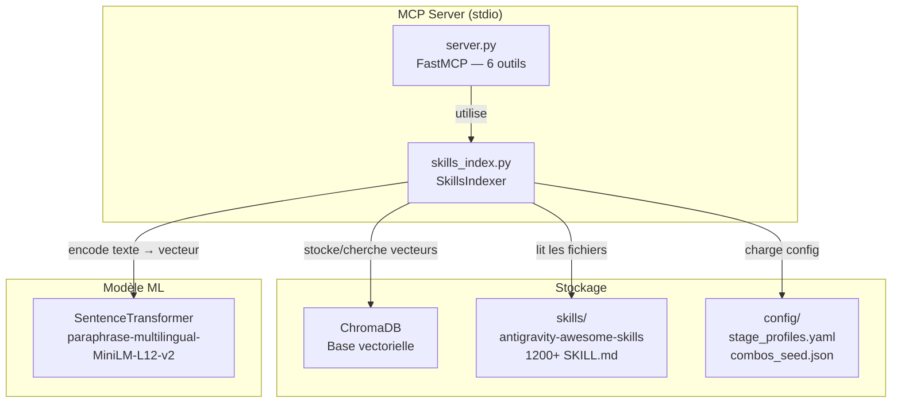
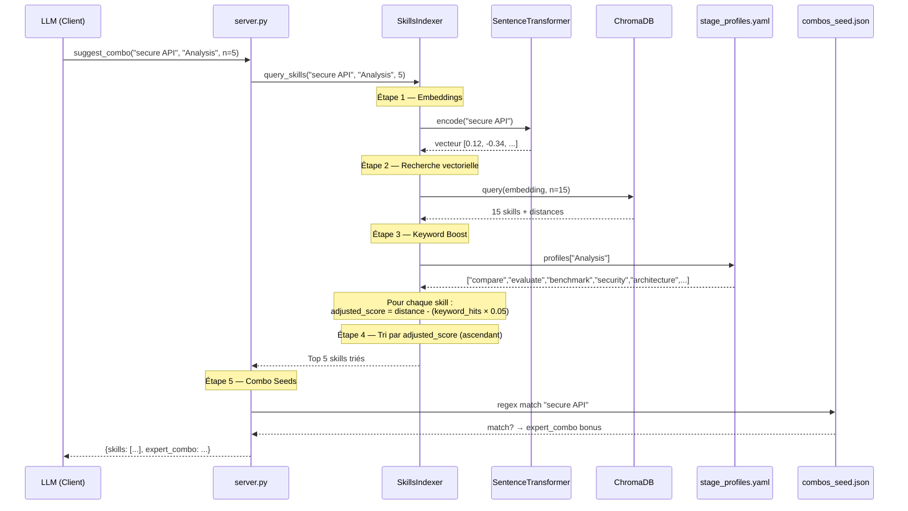
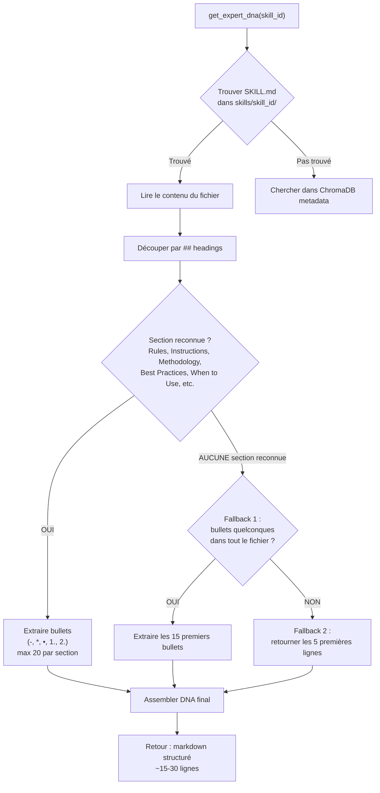
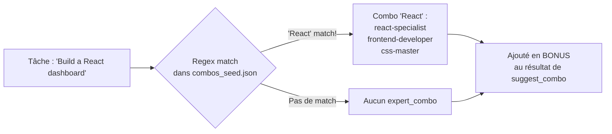
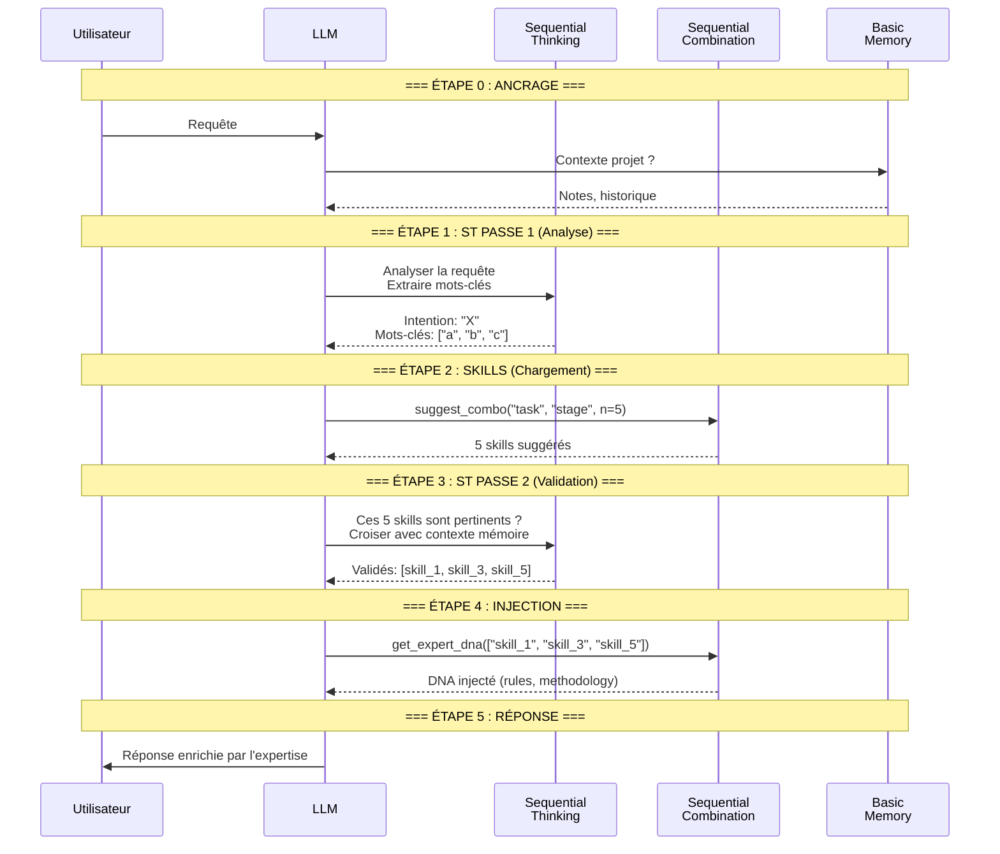
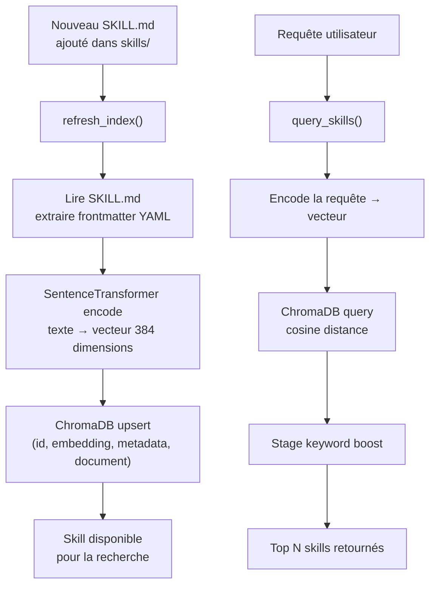

# 🧬 EXPLICATIONS — Fonctionnement Interne du MCP Sequential Combination

Ce document décrit en détail comment fonctionne chaque composant du MCP,
avec des diagrammes de flux pour visualiser les mécanismes internes.

---

## 1. Vue d'ensemble

Sequential Combination est un **serveur MCP** (Model Context Protocol) qui agit comme un
**bibliothécaire intelligent** pour les skills d'expertise. Il :

1. **Indexe** tous les fichiers `SKILL.md` dans une base vectorielle (ChromaDB)
2. **Recherche** les skills les plus pertinents pour une tâche donnée via similarité sémantique
3. **Injecte** l'expertise extraite (DNA ou contenu complet) dans le contexte du LLM

Le but : **le LLM n'utilise pas sa mémoire interne** pour les méthodologies, il utilise
les expertises structurées des SKILL.md, vérifiées et maintenues par la communauté.

---

## 2. Architecture Globale



---

## 3. Les 6 Outils — Détail

### 3.1 `list_stages`
**Rôle** : Retourne la liste des étapes cognitives disponibles.
**Source** : `config/stage_profiles.yaml`
**Flux** : Lecture YAML → extraction des clés → retour JSON

### 3.2 `suggest_combo(task, stage, n=5)`
**Rôle** : Trouve les N meilleurs skills pour une tâche à un stade cognitif donné.
**Flux détaillé** : voir diagramme ci-dessous (Section 4).

### 3.3 `get_expert_dna(skills)`
**Rôle** : Extraction chirurgicale des règles/méthodologies d'un skill.
**Token-efficient** : retourne ~15-30 bullets au lieu de 200+ lignes.
**Flux détaillé** : voir diagramme ci-dessous (Section 5).

### 3.4 `load_combo_content(skills)`
**Rôle** : Charge des sections ciblées du SKILL.md (plus complet que le DNA).
**Sections cibles** : Instructions, Methodology, Implementation, Workflow, Architecture.

### 3.5 `suggest_and_inject(task, stage, mode, n)`
**Rôle** : Combiné — fait `suggest_combo` + injection DNA/full en un seul appel.
**Usage** : Workflows simples où la validation ST intermédiaire n'est pas nécessaire.

### 3.6 `ping`
**Rôle** : Health check. Retourne "pong".

---

## 4. Flux de `suggest_combo` — Recherche Sémantique



### Comment fonctionne le tri

ChromaDB retourne des **distances cosine** (0 = identique, 2 = opposé).
Le stage profiling **réduit** cette distance pour les skills contenant des keywords du stage :

```
Score brut   = distance cosine (ex: 0.85)
Keyword hits = nombre de keywords du stage trouvés dans le SKILL.md (ex: 3)
Boost        = hits × 0.05 (ex: 0.15)
Score final  = 0.85 - 0.15 = 0.70 ← ce skill remonte dans le classement
```

Sans keywords du stage : le score reste brut.
Avec 3 keywords match : le skill gagne 0.15 points de boost.

---

## 5. Moteur DNA — Extraction d'Expertise

Le DNA (Expert DNA) est l'extraction **chirurgicale** des règles et méthodologies
d'un SKILL.md, sans tout le contenu superflu.



### Coût en tokens

| Mode | Volume moyen | Cas d'usage |
|:---|:---|:---|
| DNA (`get_expert_dna`) | ~200-500 tokens | Injection rapide, double-passe |
| Full (`load_combo_content`) | ~1000-3000 tokens | Besoin de détails complets |
| × 5 skills DNA | ~1000-2500 tokens | Workflow standard |
| × 5 skills Full | ~5000-15000 tokens | Analyse approfondie |

---

## 6. Système de Combo Seeds

Le fichier `config/combos_seed.json` contient des **associations manuelles** prédéfinies
entre des mots-clés de tâche et des groupes de skills qui fonctionnent bien ensemble.



### Important
Les combo seeds sont **complémentaires**, pas exclusifs :
- La recherche sémantique retourne toujours ses 5 meilleurs résultats
- Si un combo seed match, il est ajouté en **bonus** (`expert_combo` dans la réponse)
- Le LLM peut alors choisir de charger le DNA de ces skills bonus aussi

---

## 7. Workflow Double-Passe Recommandé

Le MCP est conçu pour fonctionner avec le protocole **double-passe** utilisant
Sequential Thinking comme validateur intermédiaire.



### Pourquoi deux passes ?

| Passe | Rôle | Sans cette passe |
|:---|:---|:---|
| **ST Passe 1** | Comprendre l'intention réelle, pas juste les mots | Le MCP cherche les mauvais skills |
| **suggest_combo** | Recherche sémantique + stage boost | Pas d'expertise chargée |
| **ST Passe 2** | Valider que les skills sont pertinents | Skills hors-sujet injectés |
| **get_expert_dna** | Injection chirurgicale des règles | Le LLM improvise |

---

## 8. Cycle de Vie d'un Skill dans l'Index



### Détail du metadata stocké dans ChromaDB

Pour chaque skill indexé, ChromaDB stocke :

| Champ | Contenu | Usage |
|:---|:---|:---|
| `id` | Nom du dossier du skill | Identifiant unique |
| `embedding` | Vecteur 384 dimensions | Recherche sémantique |
| `document` | Contenu complet du SKILL.md | Keyword matching (boost) |
| `metadata.name` | Nom du skill (frontmatter) | Affichage |
| `metadata.description` | Description courte | Affichage |
| `metadata.path` | Chemin vers le fichier | Chargement DNA/full |

---

## 9. Résumé Technique

| Composant | Technologie | Rôle |
|:---|:---|:---|
| Transport | stdio | Communication MCP standard |
| Framework | FastMCP | Serveur MCP Python |
| Embeddings | SentenceTransformer (MiniLM) | Texte → vecteur (50+ langues) |
| Vector DB | ChromaDB PersistentClient | Stockage + recherche cosine |
| Config | YAML + JSON | Stages et combo seeds |
| Batch size | 100 skills | Indexation par lots |

### Fichiers clés et leur rôle

```
server.py         → Point d'entrée, définit les 6 @mcp.tool
skills_index.py   → Moteur : indexation, recherche, extraction DNA
stage_profiles.yaml → Keywords par étape cognitive
combos_seed.json  → Associations manuelles task→skills
```
