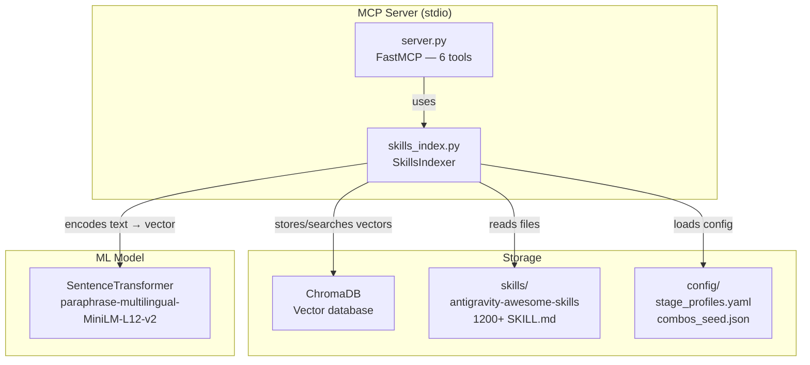
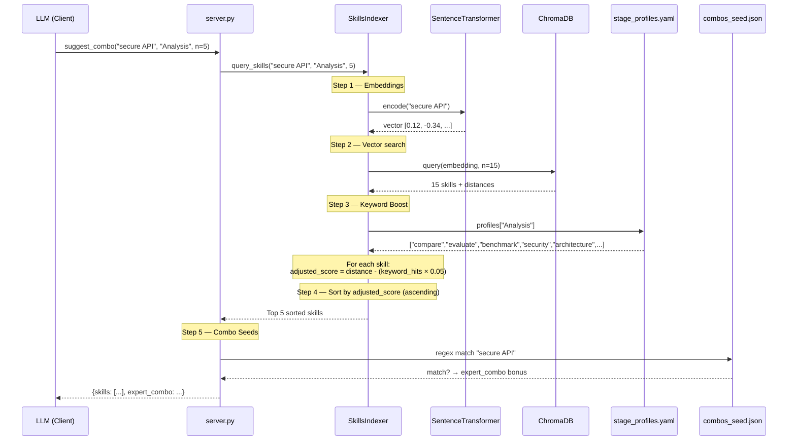
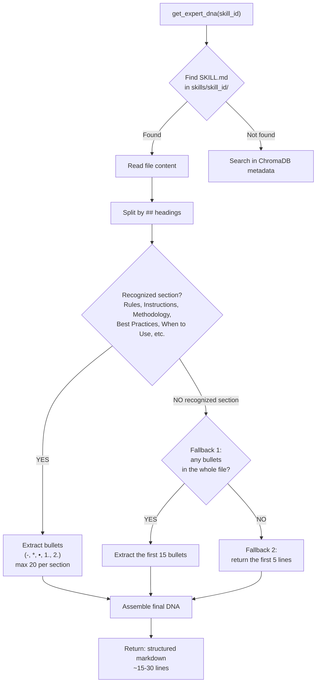
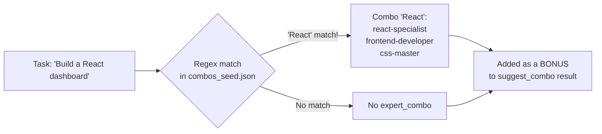
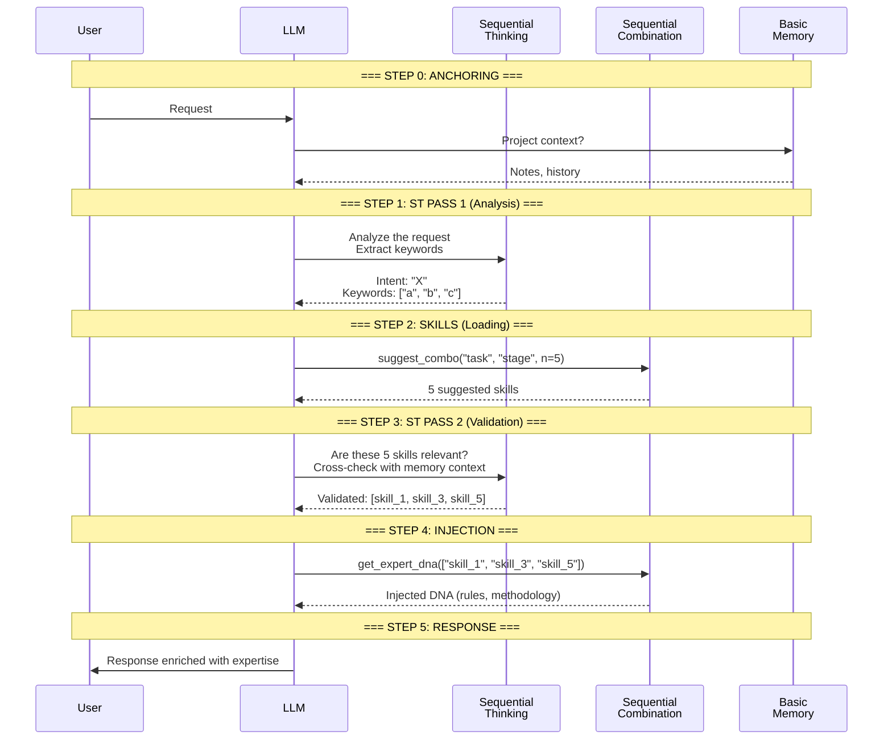
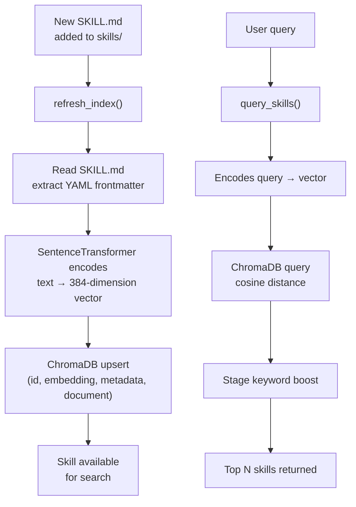

# 🧬 EXPLANATION — Internal Workflow of the Sequential Combination MCP

This document describes in detail how each component of the MCP works,
with flow diagrams to visualize the internal mechanisms.

---

## 1. Overview

Sequential Combination is an **MCP server** (Model Context Protocol) that acts as a
**smart librarian** for expertise skills. It:

1. **Indexes** all `SKILL.md` files in a vector database (ChromaDB)
2. **Searches** the most relevant skills for a given task via semantic similarity
3. **Injects** the extracted expertise (DNA or full content) into the LLM's context

The goal: **the LLM does not use its internal memory** for methodologies; it uses
structured expertise from SKILL.md files, verified and maintained by the community.

---

## 2. Global Architecture



---

## 3. The 6 Tools — Details

### 3.1 `list_stages`
**Role**: Returns the list of available cognitive stages.
**Source**: `config/stage_profiles.yaml`
**Flow**: YAML read → key extraction → JSON return

### 3.2 `suggest_combo(task, stage, n=5)`
**Role**: Finds the N best skills for a task at a given cognitive stage.
**Detailed flow**: see diagram below (Section 4).

### 3.3 `get_expert_dna(skills)`
**Role**: Surgical extraction of a skill's rules/methodologies.
**Token-efficient**: returns ~15-30 bullets instead of 200+ lines.
**Detailed flow**: see diagram below (Section 5).

### 3.4 `load_combo_content(skills)`
**Role**: Loads targeted sections of the SKILL.md (more comprehensive than DNA).
**Target sections**: Instructions, Methodology, Implementation, Workflow, Architecture.

### 3.5 `suggest_and_inject(task, stage, mode, n)`
**Role**: Combined — performs `suggest_combo` + DNA/full injection in a single call.
**Usage**: Simple workflows where intermediate ST validation is not necessary.

### 3.6 `ping`
**Role**: Health check. Returns "pong".

---

## 4. `suggest_combo` Flow — Semantic Search



### How sorting works

ChromaDB returns **cosine distances** (0 = identical, 2 = opposite).
Stage profiling **reduces** this distance for skills containing stage keywords:

```
Raw score    = cosine distance (e.g., 0.85)
Keyword hits = number of stage keywords found in SKILL.md (e.g., 3)
Boost        = hits × 0.05 (e.g., 0.15)
Final score  = 0.85 - 0.15 = 0.70 ← this skill moves up in the ranking
```

Without stage keywords: the score remains raw.
With 3 matching keywords: the skill gets a 0.15 point boost.

---

## 5. DNA Engine — Expertise Extraction

DNA (Expert DNA) is the **surgical** extraction of rules and methodologies
from a SKILL.md, without all the superfluous content.



### Token cost

| Mode | Average volume | Use case |
|:---|:---|:---|
| DNA (`get_expert_dna`) | ~200-500 tokens | Fast injection, double-pass |
| Full (`load_combo_content`) | ~1000-3000 tokens | Need for complete details |
| × 5 skills DNA | ~1000-2500 tokens | Standard workflow |
| × 5 skills Full | ~5000-15000 tokens | In-depth analysis |

---

## 6. Combo Seeds System

The `config/combos_seed.json` file contains predefined **manual associations**
between task keywords and skill groups that work well together.



### Important
Combo seeds are **complementary**, not exclusive:
- Semantic search always returns its top 5 results
- If a combo seed matches, it is added as a **bonus** (`expert_combo` in the response)
- The LLM can then choose to load the DNA of these bonus skills as well

---

## 7. Recommended Double-Pass Workflow

The MCP is designed to work with the **double-pass** protocol using
Sequential Thinking as an intermediate validator.



### Why two passes?

| Pass | Role | Without this pass |
|:---|:---|:---|
| **ST Pass 1** | Understand real intent, not just words | MCP searches for wrong skills |
| **suggest_combo** | Semantic search + stage boost | No expertise loaded |
| **ST Pass 2** | Validate skill relevance | Off-topic skills injected |
| **get_expert_dna** | Surgical rule injection | LLM improvises |

---

## 8. Skill Lifecycle in the Index



### Metadata stored in ChromaDB details

For each indexed skill, ChromaDB stores:

| Field | Content | Usage |
|:---|:---|:---|
| `id` | Skill folder name | Unique identifier |
| `embedding` | 384-dimension vector | Semantic search |
| `document` | Full SKILL.md content | Keyword matching (boost) |
| `metadata.name` | Skill name (frontmatter) | Display |
| `metadata.description` | Short description | Display |
| `metadata.path` | File path | DNA/full loading |

---

## 9. Technical Summary

| Component | Technology | Role |
|:---|:---|:---|
| Transport | stdio | Standard MCP communication |
| Framework | FastMCP | Python MCP Server |
| Embeddings | SentenceTransformer (MiniLM) | Text → vector (50+ languages) |
| Vector DB | ChromaDB PersistentClient | Storage + cosine search |
| Config | YAML + JSON | Stages and combo seeds |
| Batch size | 100 skills | Batch indexing |

### Key files and their roles

```
server.py         → Entry point, defines the 6 @mcp.tools
skills_index.py   → Engine: indexing, search, DNA extraction
stage_profiles.yaml → Keywords per cognitive stage
combos_seed.json  → Manual task→skills associations
```